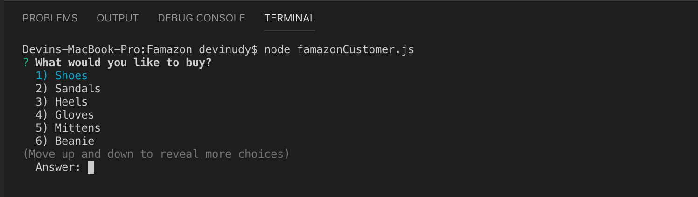

# Famazon
## Objective
* Create a create a basic backend server of an e-commerce website. 
## Examples
* `node famazonCustomer.js`
    
    * This command will display:
        * The name of the song
        * A preview link of the song from Spotify
        * The album that the song is from
## Further Development:
* Deduct units from inventory when user wants to buy something